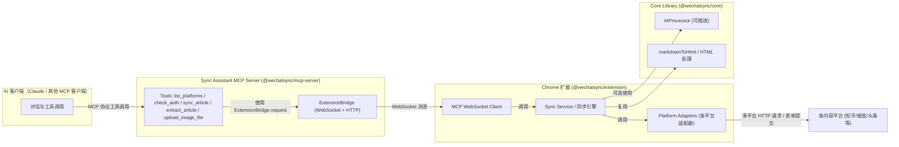
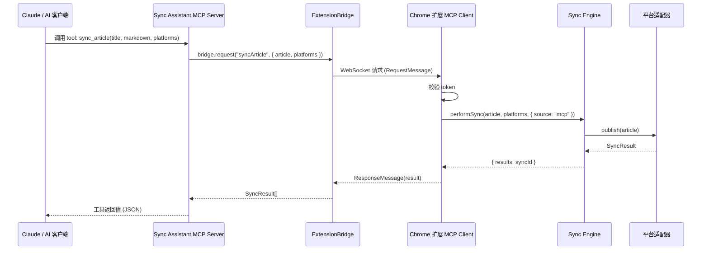

# AGENTS：智能体与 MCP 架构文档

本文档全面描述 Wechatsync 项目中与「代理（Agent）」相关的架构与功能，重点包括：

- 面向 Claude / 其他支持 MCP 的 AI 客户端的 **Sync Assistant MCP Server**
- 浏览器扩展中的 **MCP WebSocket Client**
- 负责桥接 AI 与浏览器扩展的 **ExtensionBridge**
- 可插拔的 **AIProcessor** 接口（为未来更智能的内容适配预留）

文档结构遵循你的要求，包含项目概述、代理架构总览、各代理详细说明、部署配置，以及监控与维护建议。

---

## 1. 项目概述

### 1.1 核心目标与主要功能

Wechatsync（文章同步助手）是一个开源免费的跨平台文章同步工具，核心目标是：

- 让创作者可以将微信公众号、博客等内容，一键同步到知乎、掘金、头条、CSDN 等 25+ 平台
- 降低重复粘贴、重复排版的成本，并自动处理图片上传、草稿保存等繁琐步骤
- 通过 **Anthropic MCP 协议** 与 Claude Desktop / Claude Code 等 AI 工具集成，实现：
  - 「用一句自然语言指令」完成多平台草稿创建
  - AI 辅助检查登录状态、上传图片、提取页面文章内容

主要功能：

- 微信公众号等网页文章的智能提取（标题 / 正文 / 封面）
- 一键同步文章到多个自媒体平台（草稿模式）
- 自动将文章中的图片转存到目标平台图床
- 支持 WordPress / Typecho 等自建站
- MCP 集成：AI 可以通过工具调用完成同步、检查状态、上传图片等操作

### 1.2 技术栈与框架

项目采用 Monorepo 结构，主要技术栈如下：

- 语言与构建
  - TypeScript 全面使用
  - pnpm / yarn 作为包管理器
  - tsup 用于打包 Node 模块

- 浏览器扩展（`packages/extension`）
  - Chrome 扩展 MV3（Service Worker 架构）
  - React + TypeScript + Vite
  - Tailwind CSS
  - 内置内容提取逻辑（基于 Readability 等）

- 核心逻辑（`packages/core`）
  - 平台适配器体系（各平台的发布 / 上传等逻辑）
  - 统一的同步引擎
  - Markdown/HTML 转换器、Turndown、HTML 预处理等

- MCP Server（`packages/mcp-server`）
  - Node.js（ESM 模块）
  - `@modelcontextprotocol/sdk`：MCP Server 实现
  - `express`：SSE 模式 HTTP 服务
  - `ws`：与浏览器扩展之间的 WebSocket 通信

---

## 2. 代理架构总览

### 2.1 代理角色列表

从「Agent / 代理」视角，项目中的核心代理包括：

1. **Sync Assistant MCP Server（`sync-assistant`）**
   - MCP 协议服务端，暴露一组工具给 AI 客户端使用。
2. **ExtensionBridge（`extension-bridge`）**
   - MCP Server 与浏览器扩展之间的桥接层，负责请求转发与分片上传。
3. **浏览器扩展 MCP Client（`extension-mcp-client`）**
   - 运行在 Chrome 扩展中的 WebSocket 客户端，实现来自 MCP 的具体方法调用。
4. **平台同步代理 / 同步引擎（`sync-engine`）**
   - 封装多平台同步逻辑，负责调用各平台适配器完成草稿创建。
5. **AI 处理器（`ai-processor`）**
   - 提供统一的 AI 能力接口（标题优化、摘要生成、内容适配等），当前为 Noop 实现，便于未来扩展。

### 2.2 架构图（Mermaid）

#### 2.2.1 总体调用结构



#### 2.2.2 同步文章时序图（简化）



### 2.3 交互方式与协议说明

- AI 客户端 ←→ MCP Server
  - 使用 **Anthropic MCP 协议**（标准 I/O 或 HTTP/SSE 传输）。
  - 工具定义在 `ListTools` 响应中声明，真实调用通过 `CallTool` 请求。

- MCP Server ←→ ExtensionBridge
  - 通过本地函数调用（同进程），Bridge 内部再通过 WebSocket / HTTP 转发。

- ExtensionBridge ←→ 浏览器扩展 MCP Client
  - 使用 WebSocket（默认 `ws://localhost:9527`）。
  - 消息格式为 JSON：
    - `RequestMessage`：`{ id, method, token, params }`
    - `ResponseMessage`：`{ id, result?, error? }`
  - 支持大图片的分片上传协议（`uploadImage:start` / `uploadImage:chunk` / `uploadImage:complete`）。

- 浏览器扩展 MCP Client ←→ 同步引擎 / 适配器
  - TypeScript 函数调用（同扩展进程内）。
  - 使用统一的文章对象、平台标识符与结果结构。

---

## 3. 代理详细说明

### 3.1 Sync Assistant MCP Server（`sync-assistant`）

- 位置：[`packages/mcp-server`](file:///e:/projects/opensource/Wechatsync/packages/mcp-server)
- 入口文件：
  - 标准 I/O 模式：[`src/index.ts`](file:///e:/projects/opensource/Wechatsync/packages/mcp-server/src/index.ts)
  - HTTP/SSE 模式：[`src/server.ts`](file:///e:/projects/opensource/Wechatsync/packages/mcp-server/src/server.ts)

#### 3.1.1 功能职责与业务逻辑

- 对外实现 MCP Server：
  - 注册工具：`list_platforms`、`check_auth`、`sync_article`、`extract_article`、`upload_image_file`。
  - 处理 MCP 客户端的 `ListTools` / `CallTool` 请求。
- 对内通过 `ExtensionBridge` 调用浏览器扩展完成实际操作。
- 提供 stdio 模式与 HTTP/SSE 模式两种运行方式。

#### 3.1.2 输入/输出接口规范

接口通过 MCP 工具定义，示例以 `CallTool` 输入为准。

- `list_platforms`
  - 入参：

    ```json
    {
      "forceRefresh": false
    }
    ```

  - 出参（示例）：

    ```json
    [
      {
        "id": "zhihu",
        "name": "知乎",
        "loggedIn": true
      }
    ]
    ```

- `check_auth`
  - 入参：

    ```json
    {
      "platform": "juejin"
    }
    ```

  - 出参：单个平台的登录状态信息（与 `list_platforms` 中单项结构一致）。

- `sync_article`
  - 入参（重点约定）：

    ```json
    {
      "platforms": ["zhihu", "juejin"],
      "title": "不包含 # 的纯文本标题",
      "markdown": "文章正文 Markdown，不含 # 标题行",
      "content": "<p>可选 HTML 正文</p>",
      "cover": "https://example.com/cover.png"
    }
    ```

  - 出参（示例）：

    ```json
    {
      "results": [
        {
          "platform": "zhihu",
          "success": true,
          "url": "https://zhuanlan.zhihu.com/p/xxx"
        }
      ],
      "syncId": "2024-xx-xx-xxxx"
    }
    ```

- `extract_article`
  - 入参：空对象 `{}`。
  - 出参：包含标题、正文等字段的文章结构，具体由扩展内容脚本返回。

- `upload_image_file`
  - 入参：

    ```json
    {
      "filePath": "/absolute/path/to/image.png",
      "platform": "weibo"
    }
    ```

  - 出参（示例）：

    ```json
    {
      "url": "https://pic.weibo.com/xxx",
      "platform": "weibo"
    }
    ```

#### 3.1.3 依赖服务与资源

- 依赖：
  - 本地运行的 Chrome 扩展（通过 `ExtensionBridge` 间接依赖）。
  - 环境变量：`MCP_TOKEN`（必需）、`SYNC_WS_PORT`、`SYNC_HTTP_PORT`（可选）。
  - Node.js 环境（构建后的 `dist/index.js`）。

#### 3.1.4 性能指标与 SLA（建议）

- 工具调用延迟：
  - 大部分请求（不含大量图片）在 1–3 秒内完成。
- 可用性：
  - 在扩展在线且平台接口正常情况下，工具调用成功率应 ≥ 99%。
- 并发：
  - 主要受浏览器扩展和目标网站限流约束，MCP Server 自身较轻量。

上述为建议指标，可根据实际部署环境与运营经验调整。

#### 3.1.5 错误处理机制

- 统一将错误包装为：

  ```json
  { "error": "错误描述" }
  ```

  并通过 MCP 的 `isError` 标记提示 AI 客户端。

- 常见错误：
  - 扩展未连接：返回提示「Chrome Extension 未连接，请检查是否安装 / 开启 MCP 连接」。
  - 文件不存在（上传图片）：直接在 `upload_image_file` 中抛出错误。
  - 扩展连接超时或响应异常：由 `ExtensionBridge` 抛出超时或连接失败错误。

---

### 3.2 ExtensionBridge（`extension-bridge`）

- 位置：[`packages/mcp-server/src/ws-bridge.ts`](file:///e:/projects/opensource/Wechatsync/packages/mcp-server/src/ws-bridge.ts)

#### 3.2.1 功能职责与业务逻辑

- 在 MCP Server 进程内：
  - 启动 WebSocket Server（默认端口 `9527`）供浏览器扩展连接。
  - 启动 HTTP API（默认端口 `9528` 或 `WS_PORT + 1`）供其他 MCP 实例转发请求。
- 维护 `pendingRequests`：
  - 针对每个 WebSocket 请求分配唯一 ID，等待扩展响应。
- 支持多实例模式：
  - 第一个启动的 MCP 实例为 **PRIMARY**，负责 WebSocket + HTTP。
  - 后续 MCP 实例作为 **SECONDARY**，通过 HTTP 转发请求到 PRIMARY。
- 提供 `uploadImageChunked`：
  - 将大图片按固定大小切割为多个 base64 分片，逐个通过 WebSocket 发送。

#### 3.2.2 输入/输出接口规范

- 对 MCP Server 暴露的方法：
  - `request<T>(method: string, params?: Record<string, unknown>): Promise<T>`
  - `uploadImageChunked(imageData: string, mimeType: string, platform: string): Promise<{ url: string; platform: string }>`

- 内部消息结构：

  ```json
  // 请求
  {
    "id": "timestamp-random",
    "method": "syncArticle",
    "token": "MCP_TOKEN",
    "params": { "platforms": ["zhihu"], "article": { "title": "...", "markdown": "..." } }
  }

  // 响应
  {
    "id": "timestamp-random",
    "result": { "results": [], "syncId": "..." }
  }
  ```

#### 3.2.3 依赖服务与资源

- Node.js `http` 模块与 `ws` WebSocket 库。
- 环境变量：`MCP_TOKEN`（用于下发给扩展）。

#### 3.2.4 性能指标与 SLA（建议）

- 单请求超时时间：默认约 6 分钟（考虑大批量图片上传）。
- 容忍的并发请求量：实际受浏览器扩展与平台限流影响，一般建议单机几十并发以内。

#### 3.2.5 错误处理机制

- WebSocket 未连接时直接抛错：
  - 提醒用户检查扩展是否运行。
- 在 SECONDARY 模式：
  - 若 PRIMARY 不可用，会返回「Primary MCP instance not available」类错误。
- 分片上传：
  - 超时或分片缺失会在扩展端返回错误，并被 MCP Server 透传给 AI 客户端。

---

### 3.3 浏览器扩展 MCP Client（`extension-mcp-client`）

- 位置：[`packages/extension/src/mcp/client.ts`](file:///e:/projects/opensource/Wechatsync/packages/extension/src/mcp/client.ts)

#### 3.3.1 功能职责与业务逻辑

- 建立和 MCP Server 的 WebSocket 长连接：
  - 自动重连（指数退避），最长间隔约 30 秒。
- 负责「验证 token + 分派方法调用」：
  - 所有来自 MCP 的请求必须携带正确的 `token` 才会执行。
- 具体支持的方法（`handleMethod` 内部）：
  - `listPlatforms`：调用适配器层 `checkAllPlatformsAuth`。
  - `checkAuth`：调用单个平台的 `checkPlatformAuth`。
  - `syncArticle`：转换 Markdown → HTML，构造文章对象后调用 `performSync`。
  - `extractArticle`：在当前活动标签页执行 `window.extractArticle`，提取文章。
  - `uploadImage` / `uploadImage:*` 系列：接收分片，合并、转 Blob，调用适配器上传图片。

#### 3.3.2 输入/输出接口规范

- WebSocket 入站消息（来自 MCP Server）：

  ```json
  {
    "id": "xxx",
    "method": "syncArticle",
    "token": "MCP_TOKEN",
    "params": {
      "article": { "title": "...", "markdown": "..." },
      "platforms": ["zhihu"]
    }
  }
  ```

- WebSocket 出站消息（返回给 MCP Server）：

  ```json
  {
    "id": "xxx",
    "result": { "results": [], "syncId": "..." },
    "error": null
  }
  ```

- 错误示例：

  ```json
  {
    "id": "xxx",
    "error": {
      "code": 403,
      "message": "Invalid or missing token"
    }
  }
  ```

#### 3.3.3 依赖服务与资源

- 依赖扩展内部模块：
  - `../adapters`：各平台适配器集合。
  - `../background/sync-service`：同步引擎。
  - `@wechatsync/core`：`markdownToHtml` 等工具。
- Chrome 扩展权限：
  - `tabs`、`scripting` 等，用于获取当前标签页和注入脚本。

#### 3.3.4 性能指标与 SLA（建议）

- 连接稳定性：
  - 在浏览器在线、网络正常时，应保持长期 WebSocket 连接。
- 同步耗时：
  - 与目标平台响应时间有关，通常 1–5 秒内完成单平台草稿创建。

#### 3.3.5 错误处理机制

- Token 相关错误：
  - 未配置 token：返回 `401`；
  - token 不匹配：返回 `403` 并记录告警日志。
- 业务错误：
  - 参数缺失（如未提供 `platforms` / `title` / `content`）时直接抛出明确错误信息。
- 分片上传：
  - 超时 / 分片缺失时清理会话并返回错误。

---

### 3.4 平台同步代理 / 同步引擎（`sync-engine`）

- 示例位置（扩展端）：
  - [`packages/extension/src/background/sync-service.ts`](file:///e:/projects/opensource/Wechatsync/packages/extension/src/background/sync-service.ts)（根据实际文件实现）
- 核心逻辑在 `@wechatsync/core` 中的同步引擎与平台适配器：
  - [`packages/core/src/sync/engine.ts`](file:///e:/projects/opensource/Wechatsync/packages/core/src/sync/engine.ts)

#### 3.4.1 功能职责与业务逻辑

- 接收统一的文章对象与平台列表：
  - 将文章投递到多个目标平台，返回每个平台的同步结果。
- 封装多平台差异：
  - 统一错误处理、重试（如果有）、结果收集。

#### 3.4.2 输入/输出接口规范（抽象）

- 输入：

  ```ts
  interface Article {
    title: string;
    content: string;
    html: string;
    markdown?: string;
    cover?: string;
  }

  type Platforms = string[];
  ```

- 输出（每个平台一个 `SyncResult`，结构大致如下）：

  ```ts
  interface SyncResult {
    platform: string;
    success: boolean;
    url?: string;
    error?: string;
  }
  ```

#### 3.4.3 依赖服务与资源

- 依赖 `@wechatsync/core` 中的：
  - 平台适配器（如知乎 / 掘金 / 头条等）。
  - 运行时抽象 `RuntimeInterface`（用于发 HTTP 请求、管理 cookies 等）。

#### 3.4.4 性能指标与 SLA（建议）

- 多平台同步整体耗时：
  - 一般等于「最慢平台的耗时 + 少量控制开销」。
- 成功率：
  - 高度依赖目标平台的可用性与反爬策略，建议监控单平台成功率。

#### 3.4.5 错误处理机制

- 平台层面错误：
  - 如未登录 / CSRF 失败 / 反爬校验失败等，记录在对应 `SyncResult.error` 中。
- 整体错误：
  - 部分平台失败不会影响其他平台结果，整体仍返回完整的 `results` 列表。

---

### 3.5 AI 处理器（`ai-processor`）

- 位置：[`packages/core/src/ai/index.ts`](file:///e:/projects/opensource/Wechatsync/packages/core/src/ai/index.ts)

#### 3.5.1 功能职责与业务逻辑

- 提供统一的 AI 能力接口，便于未来引入不同 Provider：
  - OpenAI、Claude、本地模型等。
- 当前默认实现为 `NoopAIProcessor`：
  - 标题保持不变；
  - 摘要为截断后的纯文本；
  - 不做标签推荐与内容改写。

#### 3.5.2 输入/输出接口规范

接口定义：

```ts
export interface AIProcessor {
  optimizeTitle(title: string, platform: string): Promise<string[]>;
  generateSummary(content: string, maxLength?: number): Promise<string>;
  suggestTags(content: string, platform: string): Promise<string[]>;
  adaptContent(
    content: string,
    sourcePlatform: string,
    targetPlatform: string,
  ): Promise<string>;
}
```

#### 3.5.3 依赖服务与资源

- 当前实现不依赖外部服务。
- 未来可通过配置扩展：
  - `provider` / `apiKey` / `baseUrl` / `model` 等。

#### 3.5.4 性能指标与 SLA（建议）

- 由于默认实现基本为同步逻辑，性能开销极小。
- 接入真实模型后：
  - 参数化超时时间与最大重试次数，并纳入整体监控。

#### 3.5.5 错误处理机制

- 当前 Noop 实现几乎不会抛错。
- 未来实际实现中，应对：
  - 请求超时、接口限流、内容安全审查失败等情况返回清晰错误信息。

---

## 4. 部署配置

### 4.1 运行环境要求

- 通用要求：
  - Node.js ≥ 18（建议）
  - pnpm / yarn 用于安装依赖

- MCP Server（`@wechatsync/mcp-server`）
  - 构建：

    ```bash
    pnpm install
    pnpm build
    ```

  - 运行：

    ```bash
    # 标准 I/O 模式（推荐）
    node packages/mcp-server/dist/index.js

    # SSE 模式
    node packages/mcp-server/dist/index.js --sse
    ```

  - 环境变量：
    - `MCP_TOKEN`：必需，用于扩展认证。
    - `SYNC_WS_PORT`：WebSocket 端口，默认 `9527`。
    - `SYNC_HTTP_PORT`：SSE HTTP 端口，默认 `9528`。

- Chrome 扩展（`@wechatsync/extension`）
  - 构建：

    ```bash
    pnpm install
    pnpm dev      # 开发模式
    pnpm build    # 生产构建
    ```

  - 加载：
    - 在 Chrome 中打开 `chrome://extensions`。
    - 开启「开发者模式」，加载 `packages/extension/dist` 目录。
    - 在扩展设置中开启「MCP 连接」，并配置与 `MCP_TOKEN` 一致的 Token。

### 4.2 部署拓扑与扩缩容策略

- MCP Server：
  - 单机多实例：
    - 通过 `ExtensionBridge` 的 PRIMARY/SECONDARY 模式支持多个 MCP 实例共享同一个扩展连接。
  - 水平扩展：
    - 每个浏览器实例本质上只能连接到本机扩展，因此 MCP Server 更像「本地 Agent」，而非典型云服务。

- 浏览器扩展：
  - 部署在用户本地浏览器，无集中扩缩容需求。

### 4.3 配置参数说明（关键）

- `MCP_TOKEN`
  - 用于 MCP Server 与扩展之间的对称认证。
  - 必须在 MCP Server 环境变量中设置，并在扩展设置里填写相同值。

- `SYNC_WS_PORT` / `SYNC_HTTP_PORT`
  - 若端口冲突，可通过环境变量修改；需保证扩展中的连接地址与之匹配。

---

## 5. 监控与维护

### 5.1 关键监控指标

建议至少监控以下指标（可通过日志采集 + 外部系统实现）：

- 连接类：
  - WebSocket 连接状态（是否连接 / 重连次数）。
  - 当前挂起的 `pendingRequests` 数量。

- 性能类：
  - MCP 每个工具调用的耗时（P50 / P95 / P99）。
  - 每次同步中各平台的耗时与成功率。

- 错误类：
  - Token 认证错误次数（401 / 403）。
  - 扩展未连接导致的失败次数。
  - 各平台发布 / 上传图片失败次数与错误原因分布。

### 5.2 日志收集策略

- MCP Server：
  - 使用 `console.error` 输出关键日志，建议将 stderr 重定向到文件或监控系统。
  - 对 ExtensionBridge 的连接状态、请求超时、PRIMARY/SECONDARY 模式切换等进行重点记录。

- 浏览器扩展：
  - 使用扩展内部的 `createLogger` 记录事件，如：
    - WebSocket 连接 / 断开 / 重连。
    - 来自 MCP 的方法调用及其结果（适度脱敏）。
  - 结合浏览器开发者工具查看背景页日志进行问题排查。

### 5.3 常见问题排查指南

1. **Claude / MCP 客户端提示工具不可用或请求超时**
   - 检查 MCP Server 是否启动，且配置文件中的路径正确。
   - 确认未误用 SSE 模式 / stdio 模式。

2. **提示「Chrome Extension 未连接」**
   - 确认扩展已成功加载且处于启用状态。
   - 在扩展设置中确保「MCP 连接」开关已打开。
   - 检查 `SYNC_WS_PORT` 设置是否一致（若自定义端口）。

3. **提示 Token 相关错误（401 / 403）**
   - 检查 MCP Server 环境变量 `MCP_TOKEN` 是否设置。
   - 确保扩展设置中的 Token 与 `MCP_TOKEN` 完全一致。

4. **上传图片失败 / 分片上传错误**
   - 查看 MCP Server 日志中是否有「Chunked upload」相关输出，确认图片大小与分片数量。
   - 检查网络是否稳定、图床平台是否正常。

5. **某些平台同步失败**
   - 通过 `list_platforms` / `check_auth` 检查该平台登录状态。
   - 查看平台适配器对应代码与最新网页 DOM 是否匹配。


